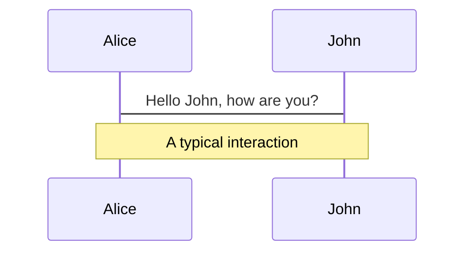
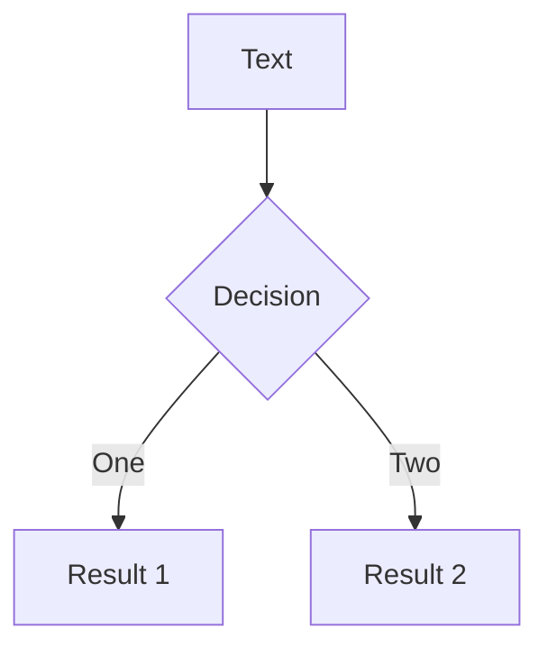
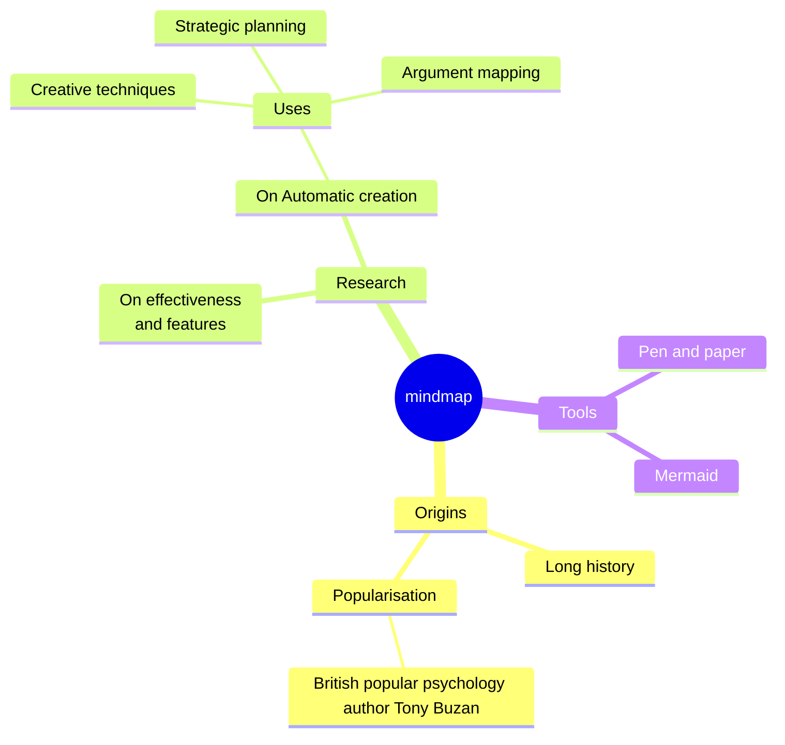
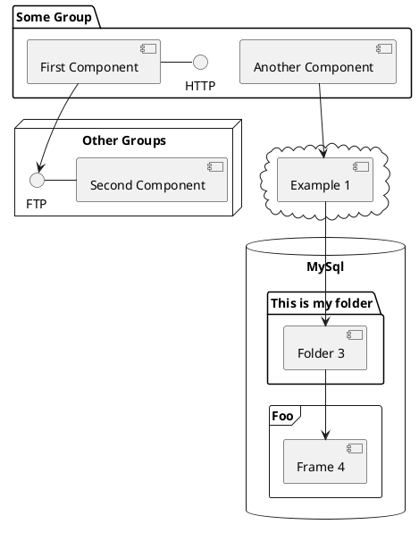

<script setup>
import Button from './components/Button.vue'
</script>

# Presentation Outline
1. Core JavaScript Refresh  
2. Asynchronous JavaScript  
3. DOM & Events  
4. ES Modules & Form Handling  
5. Node + npm & Bundlers  
6. Wrap‑up / Q &A  

<div class="abs-br m-6 text-xl">
  <button @click="$slidev.nav.openInEditor()" title="Open in Editor" class="slidev-icon-btn">
    <carbon:edit />
  </button>
  <a href="https://github.com/slidevjs/slidev" target="_blank" class="slidev-icon-btn">
    <carbon:logo-github />
  </a>
</div>

---
transition: fade-out
---


# 1 Core JS Refresh

```js [1|3-5|7-9]
const originals = [1, 2, 3]
const clone = [...originals]   // new copy
clone.push(4)

console.log(originals) // → [1,2,3]
console.log(clone)     // → [1,2,3,4]

// rest parameter
function sum(...nums) {
  return nums.reduce((a, b) => a + b, 0)
}
```

### Key takeaways
- Spread avoids accidental mutation
- Rest collects unknown arguments

<style>
h1 {
  background-color: #2B90B6;
  background-image: linear-gradient(45deg,rgb(189, 214, 124) 10%,rgb(230, 250, 53) 20%);
  background-size: 100%;
  -webkit-background-clip: text;
  -moz-background-clip: text;
  -webkit-text-fill-color: transparent;
  -moz-text-fill-color: transparent;
}
</style>

---
transition: slide-up
level: 2
---

# 2 Asynchronous JavaScript
```js
async function getGitHubUser(username) {
  const res = await fetch(`https://api.github.com/users/${username}`)
  if (!res.ok) throw new Error('Network error')
  return res.json()
}

getGitHubUser('octocat')
  .then(user => console.log(user.login))
  .catch(console.error)
```

- Promises tame callback hell

- `async/await` reads top‑to‑bottom

- Always handle errors `(try/catch or .catch())`

<style>
h1 {
  background-color: #2B90B6;
  background-image: linear-gradient(45deg,rgb(189, 214, 124) 10%,rgb(230, 250, 53) 20%);
  background-size: 100%;
  -webkit-background-clip: text;
  -moz-background-clip: text;
  -webkit-text-fill-color: transparent;
  -moz-text-fill-color: transparent;
}
</style>

---

# 3 DOM & Events
```html
<button id="btn">Clicked 0 times</button>

<script type="module">
  const btn = document.getElementById('btn')
  let count = 0

  btn.addEventListener('click', e => {
    count++
    e.currentTarget.textContent = `Clicked ${count} times`
  })
</script>
```

<Button :m="t-4" />

- `addEventListener` is preferred

- Understand bubbling vs capturing

- Use delegation for long lists

<!-- This allow you to embed external code blocks -->

<!-- Inline style -->
<style>
  h1 {
  background-color: #2B90B6;
  background-image: linear-gradient(45deg,rgb(189, 214, 124) 10%,rgb(230, 250, 53) 20%);
  background-size: 100%;
  -webkit-background-clip: text;
  -moz-background-clip: text;
  -webkit-text-fill-color: transparent;
  -moz-text-fill-color: transparent;
}

.footnotes-sep {
  @apply mt-5 opacity-10;
}
.footnotes {
  @apply text-sm opacity-75;
}
.footnote-backref {
  display: none;
}
</style>

<!--
Notes can also sync with clicks

[click] This will be highlighted after the first click

[click] Highlighted with `count = ref(0)`

[click:3] Last click (skip two clicks)
-->

---
level: 3
---

# 4 ES Modules + Dynamic import()
```js
// utils/math.js
export function add(a, b) { return a + b }
export default function mul(a, b) { return a * b }

// main.js
import mul, { add } from './utils/math.js'

(async () => {
  if (performance.now() > 5000) {
    const { sparkle } = await import('./effects/sparkle.js')
    sparkle()
  }
})();
```

**Why it matters:** predictable scope, tree‑shaking, lazy‑loading.

<style>
h1 {
  background-color: #2B90B6;
  background-image: linear-gradient(45deg,rgb(189, 214, 124) 10%,rgb(230, 250, 53) 20%);
  background-size: 100%;
  -webkit-background-clip: text;
  -moz-background-clip: text;
  -webkit-text-fill-color: transparent;
  -moz-text-fill-color: transparent;
}
</style>

---
Level: 3b
---

### Form Handling with FormData
```html
<form id="todoForm">
  <input name="task" required>
  <button>Add</button>
</form>

<script type="module">
  todoForm.addEventListener('submit', e => {
    e.preventDefault()
    const data = new FormData(e.target)
    console.log(Object.fromEntries(data)) // { task: "Buy milk" }
  })
</script>
```

- `preventDefault()` stops page reload

- `FormData` quickly serialises any form

<style>
h3 {
  background-color: #2B90B6;
  background-image: linear-gradient(45deg,rgb(189, 214, 124) 10%,rgb(230, 250, 53) 20%);
  background-size: 100%;
  -webkit-background-clip: text;
  -moz-background-clip: text;
  -webkit-text-fill-color: transparent;
  -moz-text-fill-color: transparent;
}
</style>

---

# Node & NPM + Bundlers

```bash
npm init -y            # generates package.json
npm i -D vite          # ultra‑fast dev server
npm run dev            # HMR at localhost:5173
npm run build          # output /dist with hashed assets
vite preview           # test production build
```

| Why bundlers?                                      | Benefits                           |
| -------------------------------------------------- | ---------------------------------- |
| Browsers can’t import SVG/PNG or npm libs directly | Bundlers translate everything      |
| Code‑splitting & optimisation                      | Smaller, faster production bundles |
| Dev server with HMR                                | Instant feedback while coding      |


<!--
Presenter note with **bold**, *italic*, and ~~striked~~ text.

Also, HTML elements are valid:
<div class="flex w-full">
  <span style="flex-grow: 1;">Left content</span>
  <span>Right content</span>
</div>
-->

---
class: px-20
---

# Themes

Slidev comes with powerful theming support. Themes can provide styles, layouts, components, or even configurations for tools. Switching between themes by just **one edit** in your frontmatter:

<div grid="~ cols-2 gap-2" m="t-2">

```yaml
---
theme: default
---
```

```yaml
---
theme: seriph
---
```


</div>

Read more about [How to use a theme](https://sli.dev/guide/theme-addon#use-theme) and
check out the [Awesome Themes Gallery](https://sli.dev/resources/theme-gallery).

---

# Clicks Animations

You can add `v-click` to elements to add a click animation.

<div v-click>

This shows up when you click the slide:

```html
<div v-click>This shows up when you click the slide.</div>
```

</div>

<br>

<v-click>

The <span v-mark.red="3"><code>v-mark</code> directive</span>
also allows you to add
<span v-mark.circle.orange="4">inline marks</span>
, powered by [Rough Notation](https://roughnotation.com/):

```html
<span v-mark.underline.orange>inline markers</span>
```

</v-click>

<div mt-20 v-click>

[Learn more](https://sli.dev/guide/animations#click-animation)

</div>

---

# Motions

Motion animations are powered by [@vueuse/motion](https://motion.vueuse.org/), triggered by `v-motion` directive.

```html
<div
  v-motion
  :initial="{ x: -80 }"
  :enter="{ x: 0 }"
  :click-3="{ x: 80 }"
  :leave="{ x: 1000 }"
>
  Slidev
</div>
```

<div class="w-60 relative">
  <div class="relative w-40 h-40">
    
    
    
  </div>

  <div
    class="text-5xl absolute top-14 left-40 text-[#2B90B6] -z-1"
    v-motion
    :initial="{ x: -80, opacity: 0}"
    :enter="{ x: 0, opacity: 1, transition: { delay: 2000, duration: 1000 } }">
    Slidev
  </div>
</div>

<!-- vue script setup scripts can be directly used in markdown, and will only affects current page -->
<script setup lang="ts">
const final = {
  x: 0,
  y: 0,
  rotate: 0,
  scale: 1,
  transition: {
    type: 'spring',
    damping: 10,
    stiffness: 20,
    mass: 2
  }
}
</script>

<div
  v-motion
  :initial="{ x:35, y: 30, opacity: 0}"
  :enter="{ y: 0, opacity: 1, transition: { delay: 3500 } }">

[Learn more](https://sli.dev/guide/animations.html#motion)

</div>

---

# LaTeX

LaTeX is supported out-of-box. Powered by [KaTeX](https://katex.org/).

<div h-3 />

Inline $\sqrt{3x-1}+(1+x)^2$

Block
$$ {1|3|all}
\begin{aligned}
\nabla \cdot \vec{E} &= \frac{\rho}{\varepsilon_0} \\
\nabla \cdot \vec{B} &= 0 \\
\nabla \times \vec{E} &= -\frac{\partial\vec{B}}{\partial t} \\
\nabla \times \vec{B} &= \mu_0\vec{J} + \mu_0\varepsilon_0\frac{\partial\vec{E}}{\partial t}
\end{aligned}
$$

[Learn more](https://sli.dev/features/latex)

---

# Diagrams

You can create diagrams / graphs from textual descriptions, directly in your Markdown.

<div class="grid grid-cols-4 gap-5 pt-4 -mb-6">









</div>

Learn more: [Mermaid Diagrams](https://sli.dev/features/mermaid) and [PlantUML Diagrams](https://sli.dev/features/plantuml)

---
foo: bar
dragPos:
  square: 691,32,167,_,-16
---

# Draggable Elements

Double-click on the draggable elements to edit their positions.

<br>

###### Directive Usage

```md

```

<br>

###### Component Usage

```md
<v-drag text-3xl>
  <div class="i-carbon:arrow-up" />
  Use the `v-drag` component to have a draggable container!
</v-drag>
```

<v-drag pos="663,206,261,_,-15">
  <div text-center text-3xl border border-main rounded>
    Double-click me!
  </div>
</v-drag>


###### Draggable Arrow

```md
<v-drag-arrow two-way />
```

<v-drag-arrow pos="67,452,253,46" two-way op70 />

---
src: ./pages/imported-slides.md
hide: false
---

---

# Monaco Editor

Slidev provides built-in Monaco Editor support.

Add `{monaco}` to the code block to turn it into an editor:

```ts {monaco}
import { ref } from 'vue'
import { emptyArray } from './external'

const arr = ref(emptyArray(10))
```

Use `{monaco-run}` to create an editor that can execute the code directly in the slide:

```ts {monaco-run}
import { version } from 'vue'
import { emptyArray, sayHello } from './external'

sayHello()
console.log(`vue ${version}`)
console.log(emptyArray<number>(10).reduce(fib => [...fib, fib.at(-1)! + fib.at(-2)!], [1, 1]))
```

---
layout: center
class: text-center
---

# Learn More

[Documentation](https://sli.dev) · [GitHub](https://github.com/slidevjs/slidev) · [Showcases](https://sli.dev/resources/showcases)

<PoweredBySlidev mt-10 />
